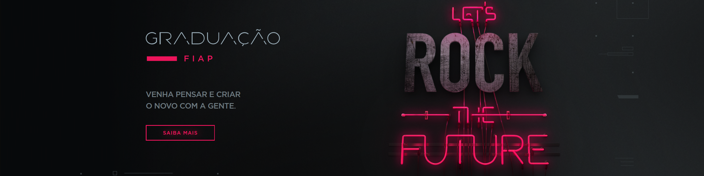
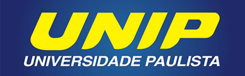

  

<h1 align="center">🚀 Desenvolvedor Full Stack</h1>
<h1 align="center">📊 Cientista de Dados</h1>

  <b>💡 Atualmente focado em converter dados em decisões inteligentes.</b> 
  Unindo a base sólida de <b>Análise e Desenvolvimento de Sistemas</b> com a especialização em 
  <b>Data Science: Big Data e Engenharia de Dados (FIAP)</b>. 
  Background em <b>Design Gráfico Profissional</b>, entregando soluções funcionais, 
  intuitivas e visualmente profissionais.

## 🛠️ Tecnologias e Ferramentas

---

### 💻 Linguagens de Programação

  
  
  
  

---

### ⚙️ Frameworks & Plataformas

  
  
  

---

### 📊 Data Science & BI

  
  

---

### 🔐 Banco de Dados

  
  

---

### 🌐 Desenvolvimento Web

  
  
  

---

### 📱 Desenvolvimento Mobile

  

---

### 🏢 Sistemas ERP

  
  

---

### 🎭 Design Gráfico & UX/UI

  
  
  
  
  
  

---

### 📠 Infraestrutura & Corporativo

  
  
  
  

---

### ☁️ Cloud & DevOps

  

## 🎓 Formação Acadêmica

  
<b>📊 Data Science – Big Data, BI & Data Engineering | FIAP (2026–2027)</b>
  

  

📚 **Carga Horária:** 2000 horas

### 📘 1º Ano – 2026
- **Modern Data Architecture & Engineering:** Big Data, Hadoop, Spark, Data Lakes, Kafka, ELK, Redshift, BigQuery, Snowflake, Cloud AWS/Google Cloud, Governança & Segurança.
- **Data Architecture, Analytics & NoSQL:** Linux, Oracle, MongoDB, Cassandra, Redis, Neo4J, ELK, Cloud AWS/Google/OCI.
- **Smart SQL & Relational Database:** Modelagem relacional, SQL, JOINs, Subqueries, Aggregations, Integração com IA.
- **Data Ethics, Governance & Security:** LGPD/GDPR, Governança de Dados, Segurança, Ética em IA.
- **Statistical Methods for DS & ML:** Estatística, Pandas, NumPy, Matplotlib, Testes de Hipótese, Introdução a Machine Learning, Mineração de Texto e Imagem.
- **Building Data-Driven Applications:** Python & PL/SQL, Streamlit, Looker Studio, APIs, Web Scraping, Procedures, Triggers e Automação.

### 📘 2º Ano – 2027
- **Data Protection & Ingestion Solutions:** Backup & Disaster Recovery, Replicação & CDC, ETL com Hadoop (SQOOP), Flume, NiFi, Data Pipelines.
- **Artificial Intelligence & Deep Learning:** Redes Neurais (ANN, CNN, LSTM), Visão Computacional, OCR & Reconhecimento de Voz, NLP & IA Generativa, Reinforcement Learning.
- **Business Intelligence & AI Analytics:** Data Storytelling, Tableau, Power BI, Dashboards Interativos, Análise Preditiva, Sistemas de Recomendação.
- **Applied Machine Learning & AI:** Regressão Linear, Árvores de Decisão, Random Forest, SVM, KNN, PageRank, XGBoost, Ensemble Methods, NLP & Análise de Sentimentos, Séries Temporais.
- **Cloud Solutions & Scalable Infrastructure:** AWS, Azure, Google Cloud & OCI, Docker & Kubernetes, Serverless Computing, Multicloud & BDaaS, Segurança (Least Privilege, MFA).
- **Data Warehousing & Advanced Integration:** Star Schema & Snowflake, SCD & Modelagem Dimensional, ETL com Azure Data Factory, Pipelines de Dados, Integração TXT, CSV, Excel, Oracle e Azure SQL.

📊 **Status:** Cursando...  
🎯 **Foco:** Engenharia de Dados, Machine Learning, Cloud & Business Intelligence

  
<b>⚙️ Análise e Desenvolvimento de Sistemas | UNIP (2024–2025)</b>
  

  

📚 **Carga Horária Total:** 2.520 Horas

### 📘 1º Ano – 2024
- **Base Lógica & Matemática:** Lógica, Estatística, Matemática para Computação.
- **Fundamentos Técnicos:** Fundamentos de Sistemas Operacionais, Organização de Computadores, Princípios de Sistemas de Informação, Fundamentos de Redes de Dados e Comunicação.
- **Desenvolvimento & Engenharia:** Linguagem e Técnicas de Programação, Engenharia de Software I.
- **Formação Transversal:** Comunicação Aplicada, Direitos Humanos, Desenvolvimento Sustentável, Educação Ambiental, Ética e Legislação Profissional, Metodologia Científica e Estudos Disciplinares.
- **Projetos Integradores:** Projeto Integrado Multidisciplinar (PIM) I e II.

### 📘 2º Ano – 2025
- **Desenvolvimento & Arquitetura:** Programação Orientada a Objetos I e II, Análise de Sistemas Orientada a Objetos, Desenvolvimento de Software para Internet, Tópicos Especiais em Programação Orientada a Objetos e Projeto de Sistemas Orientado a Objetos.
- **Dados & Interface:** Banco de Dados, Projeto de Interface com o Usuário (UI/UX).
- **Gestão & Estratégia:** Engenharia de Software II, Gerenciamento de Projetos de Software, Gestão da Qualidade, Empreendedorismo, Gestão Estratégica de RH, Economia e Mercado e Marketing Pessoal.
- **Inclusão & Sociedade:** Língua Brasileira de Sinais (LIBRAS) e Relações Étnico-Raciais/Afrodescendência.
- **Projetos Integradores:** Projeto Integrado Multidisciplinar (PIM) III e IV.

📊 **Status:** 100% das disciplinas concluídas e aprovação geral de 8,1/10,0  
🎯 **Foco:** Formação sólida em ciclo de vida de software, desde a infraestrutura e lógica até a gestão e desenvolvimento full-stack.

---

## 💼 Experiência Profissional
- **Anidrol Indústria Química** — Help Desk (N1/N2, segurança digital)
- **YOFC Brasil** — Estagiário de Logística (dados operacionais e ERP)
- **Freelance Design** — Identidade visual e design profissional

---

## 🚀 Projetos em Destaque

### 🚀 Achadinhos da Ana (Web App Full Stack)
🔗 https://achadinhos-da-ana.onrender.com/

**Descrição:**  
Aplicação web desenvolvida com Django, utilizando banco de dados relacional para gerenciamento dinâmico de produtos.  
Sistema estruturado com backend robusto, rotas organizadas e renderização dinâmica de conteúdo.

**Tecnologias utilizadas:**  
Python • Django • Banco de Dados SQL • HTML • CSS • JavaScript

**Diferenciais técnicos:**  
- Backend estruturado em Django  
- Integração com banco de dados  
- Renderização dinâmica de dados  
- Deploy em ambiente cloud (Render)  
- Arquitetura MVC (Model-View-Template)

### 🌐 Solutiuns
🔗 https://www.solutiuns.com.br/

**Descrição:**  
Website institucional moderno e responsivo desenvolvido para a Solutiuns, com foco em apresentação de serviços, informações corporativas e contato integrado.  
O projeto prioriza usabilidade e experiência do usuário com navegação fluida e design limpo.

**Tecnologias utilizadas:**  
HTML • CSS • JavaScript • PHP

**Principais diferenciais:**  
- Layout responsivo para desktop e mobile  
- Estrutura semântica e SEO básico  
- Navegação intuitiva e otimizada

---

### 🌐 DDMeng
🔗 https://ddmeng.com.br/

**Descrição:**  
Site profissional para a DDMeng, uma empresa do setor de engenharia.  
O projeto apresenta portfólio de serviços, seções sobre expertise da empresa e integração de contato para geração de leads.

**Tecnologias utilizadas:**  
HTML • CSS • JavaScript • PHP

**Principais diferenciais:**  
- Design orientado à conversão de visitantes em contatos  
- Seções bem organizadas destacando serviços e diferenciais  
- Ênfase em clareza visual e performance

---

### 🌐 RRF Soluções
🔗 https://www.rrfsolucoes.com.br/

**Descrição:**  
Website corporativo desenvolvido para a RRF Soluções, com objetivo de apresentar soluções empresariais e facilitar o contato com o público-alvo.  
Projeto com visual profissional e foco em identidade da marca.

**Tecnologias utilizadas:**  
HTML • CSS • JavaScript • PHP

**Principais diferenciais:**  
- Interface moderna com foco na marca  
- Estrutura de conteúdo clara e organizada  
- Compatibilidade com dispositivos móveis

## 🏆 Certificações

  
<b>🔥 Clique para ver certificados</b>

Use exatamente assim 👇

🏆 Cursos e Certificações

🌍 Idiomas
- ✅Michigan English Test (MET) — 2022

📊 Dados, IA & Tecnologia
- ✅Introduction to Data Science — Cisco Networking Academy (2025)
- ✅Princípios básicos de Machine Learning — Microsoft Learn (2024)
- ✅Implementando Banco de Dados — Fundação Bradesco (2024)
- ✅Desvendando a Blockchain — SENAI (2024)
- ✅Ética na Inteligência Artificial — SENAI (2024)
- ✅Introduction to IoT — Cisco Networking Academy (2024)

🐍 Programação & Desenvolvimento Web
- ✅Python Essentials 1 — Cisco Networking Academy (2024)
- ✅Fundamentos do Python 1 — SENAI (2024)
- ✅Crie um site simples usando HTML, CSS e JavaScript — Fundação Bradesco (2024)

🖥️ Infraestrutura, Hardware & Segurança
- ✅Fundamentos de TI: Hardware e Software — Fundação Bradesco (2024)
- ✅Computer Hardware Basics — Cisco Networking Academy (2024)
- ✅Segurança em Tecnologia da Informação — Fundação Bradesco (2024)
- ✅Por dentro da Segurança Cibernética — SENAI (2024)
- ✅Windows 10 — Fundação Richard Hugh Fisk (2018)

🎨 Design Gráfico & Web Design
- ✅Adobe Photoshop — 2019
- ✅CorelDRAW — 2019
- ✅Adobe Illustrator — 2020
- ✅Adobe InDesign — 2020
- ✅Adobe Dreamweaver — 2020
- ✅Adobe Flash — 2021

💼 Ferramentas Corporativas & Gestão
- ✅Pacote Office (Word, Excel e PowerPoint) — 2018
- ✅Gestão Financeira — SEBRAE (2024)
- ✅Competência Transversal: Tecnologia da Informação e Comunicação — SENAI (2024)

🎓 Formação Complementar & Carreira
- ✅Introdução à Construção de Carreira — Estudante.dev (2024)
- ✅Formação Básica para o Mundo do Trabalho — Sodiprom (2022)

🏫 Eventos & Participações Acadêmicas
- ✅Certificado de Participação — 2ª Jornada Tecnológica UNIP Anchieta — 2025

## 📬 Contato

  
  

<i>"A persistência é o caminho do êxito."</i>

